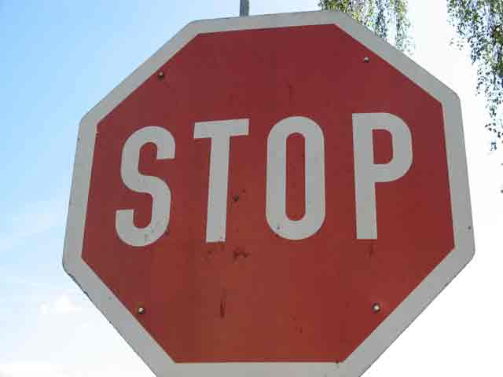
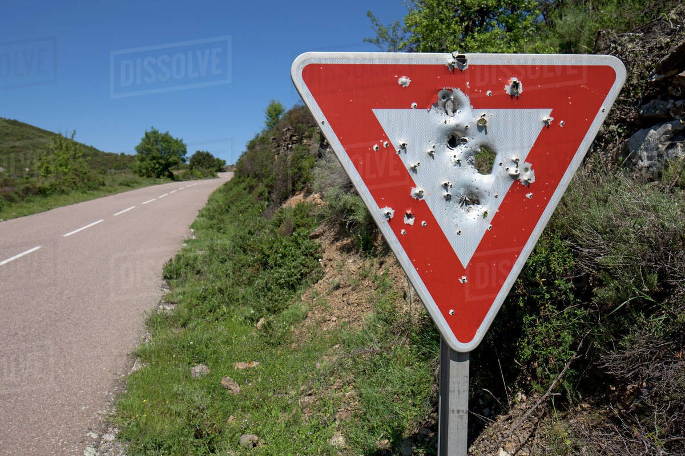
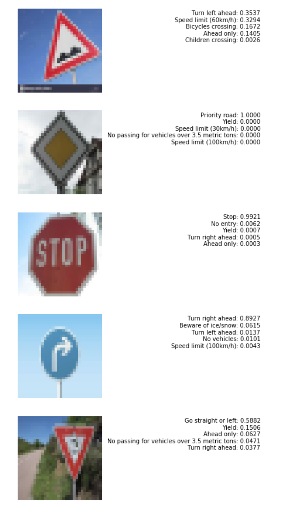

# **Traffic Sign Recognition** 

## Writeup

### You can use this file as a template for your writeup if you want to submit it as a markdown file, but feel free to use some other method and submit a pdf if you prefer.

---

**Build a Traffic Sign Recognition Project**

The goals / steps of this project are the following:
* Load the data set (see below for links to the project data set)
* Explore, summarize and visualize the data set
* Design, train and test a model architecture
* Use the model to make predictions on new images
* Analyze the softmax probabilities of the new images
* Summarize the results with a written report

[//]: # (Image References)

[image1]: ./writeup_assets/train_freq.png "Training frequency"
[image2]: ./writeup_assets/valid_test_freq.png "Validation/Test frequency"
[image3]: ./writeup_assets/expanded_freq.png "Expanded dataset"
[image4]: ./writeup_assets/rotated.png "Rotated"
[image10]: ./writeup_assets/acc_cost.png "Accuracy vs cost"

## Rubric Points
### Here I will consider the [rubric points](https://review.udacity.com/#!/rubrics/481/view) individually and describe how I addressed each point in my implementation.  

---
### Writeup / README

#### 1. Provide a Writeup / README that includes all the rubric points and how you addressed each one. You can submit your writeup as markdown or pdf. You can use this template as a guide for writing the report. The submission includes the project code.

You're reading it! and here is a link to my [project code](https://github.com/msqz/CarND-Traffic-Sign-Classifier-Project/blob/master/Traffic_Sign_Classifier.ipynb)

### Data Set Summary & Exploration

#### 1. Provide a basic summary of the data set. In the code, the analysis should be done using python, numpy and/or pandas methods rather than hardcoding results manually.

I used the pandas library to calculate summary statistics of the traffic
signs data set:

* The size of training set is 34799
* The size of the validation set is 4410
* The size of test set is 12630
* The shape of a traffic sign image is 32x32x3
* The number of unique classes/labels in the data set is 43

#### 2. Include an exploratory visualization of the dataset.

Here is an exploratory visualization of the data set. Diagrams below show frequency of classes in particular sets:

![alt text][image1]

![alt text][image2]

### Design and Test a Model Architecture

#### 1. Describe how you preprocessed the image data. What techniques were chosen and why did you choose these techniques? Consider including images showing the output of each preprocessing technique. Pre-processing refers to techniques such as converting to grayscale, normalization, etc. (OPTIONAL: As described in the "Stand Out Suggestions" part of the rubric, if you generated additional data for training, describe why you decided to generate additional data, how you generated the data, and provide example images of the additional data. Then describe the characteristics of the augmented training set like number of images in the set, number of images for each class, etc.)

The training set is expanded in a way, that each class has the same number of examples. Additional examples are generated in following way:
1. Max. frequency is picked from training set as a reference value.
2. For each class a set of corresponding samples is replicated as many times as needed to fill up the gap between that particular class frequency and the reference value.
3. Each replicated sample is processed to provide new features. Processing may include blurring, sharpening or rotating. Example below shows the result of rotating:
![alt text][image4]

Expanding the training set allows to get away from skewed data, since there are significant differences between number of occurences in provided set.
For example class `0,Speed limit (20km/h)` has only 180 occurences but class `2,Speed limit (50km/h)` has 2010 occurences.
Diagram below shows the frequency after exanding the dataset:
![alt text][image3]

Therefore the total training set size is 86430.

After expanding, the training set gets normalized, so the values are varying between -1.0 and 1.0. Thanks to that the features have the same order of magnitude, so initially they have similar impact on learning process. Moreover during the backpropagation weights are adjusted in more equal way.

#### 2. Describe what your final model architecture looks like including model type, layers, layer sizes, connectivity, etc.) Consider including a diagram and/or table describing the final model.

My final model is a LeNet implementation, consisted of the following layers:

| Layer         		|     Description	        					| 
|:---------------------:|:---------------------------------------------:| 
| Input         		| 32x32x3 RGB image   							| 
| Convolution 5x5     	| 1x1 stride, valid padding, outputs 28x28x6 	|
| RELU					|												|
| Max pooling	      	| 2x2 stride, same padding, outputs 14x14x6 	|
| Convolution 5x5	    | 1x1 stride, valid padding, outputs 10x10x16	|
| RELU					|												|
| Max pooling	      	| 2x2 stride, same padding, outputs 5x5x16   	|
| Fully connected		| inputs 120, outputs 84        				|
| Fully connected		| inputs 84, outputs 43         				|

 
#### 3. Describe how you trained your model. The discussion can include the type of optimizer, the batch size, number of epochs and any hyperparameters such as learning rate.

To train the model, I used cross-entropy calculation and Adam optimizer. There is L2 regularization and dropout implemented. Below are applied hyperparameters values (BETA is the regularization coefficient and DROPOUT is the probability of keeping weight):

EPOCHS = 100
BATCH_SIZE = 128
LEARNING_RATE = 0.001
BETA = 0.001
DROPOUT = 0.5

#### 4. Describe the approach taken for finding a solution and getting the validation set accuracy to be at least 0.93. Include in the discussion the results on the training, validation and test sets and where in the code these were calculated. Your approach may have been an iterative process, in which case, outline the steps you took to get to the final solution and why you chose those steps. Perhaps your solution involved an already well known implementation or architecture. In this case, discuss why you think the architecture is suitable for the current problem.

My final model results were:
* training set accuracy of 0.9418
* validation set accuracy of 0.9751
* test set accuracy of 0.9397

Solution is based on LeNet architecture. I chose that, because traffic signs application is an image classification problem - recognizing visual patterns is the design objective of LeNet network.

Diagrams below illustrates how the cost and the accuracy was changing during the training:

![alt text][image10]

There are many peak values on the validation accuracy diagram. During training the highest accuracy peak is detected and the corresponding network state is saved. That state is used as the final model.

What helped most in increasing accuracy and removing overfitting:
1. Expanding the training set with visually modified examples in a way, that they provide new features.
2. Dropout - that creates a big gap between validation and accuracy cost for the first epoch - see diagram above/
3. L2 regularization.

### Test a Model on New Images

#### 1. Choose five German traffic signs found on the web and provide them in the report. For each image, discuss what quality or qualities might be difficult to classify.

Here are five German traffic signs that I found on the web:

The first image might be difficult to classify because ...

#### 2. Discuss the model's predictions on these new traffic signs and compare the results to predicting on the test set. At a minimum, discuss what the predictions were, the accuracy on these new predictions, and compare the accuracy to the accuracy on the test set (OPTIONAL: Discuss the results in more detail as described in the "Stand Out Suggestions" part of the rubric).

Here are the results of the prediction:

| Image			        |     Prediction	        					| 
|:---------------------:|:---------------------------------------------:| 
| Bumpy road Sign      		| Turn left ahead sign   									| 
| Priority road     			| Priority road 										|
| Stop					| Stop											|
| Turn rightt ahead	      		| Turn right ahead					 				|
| Yield			| Go straight or left      							|

The model was able to correctly guess 3 of the 5 traffic signs, which gives an accuracy of 60%. This is not very similar to the performance obtained on the test set.

What differs new signs from the test set is the fact, that they are no cropped like in the test set, especially in misclassified signs it's visible, that the background takes the most part of the image.

#### 3. Describe how certain the model is when predicting on each of the five new images by looking at the softmax probabilities for each prediction. Provide the top 5 softmax probabilities for each image along with the sign type of each probability. (OPTIONAL: as described in the "Stand Out Suggestions" part of the rubric, visualizations can also be provided such as bar charts)

Top 5 softmax probabilities for classified signs are following:

The correct class for bumpy road sign was not event considered by the classifier.

For yield sign, the correct class was on the 2nd place of probabilities ranking also the major prediction here was not very strong (0.58 compared to 0.89+ for correctly classified signs).

Classification for priority road sign looks interesting - the network is 100% sure about the predicted class. The fact is that priority road sign is the unique one in the dataset - it has diamond shape and no red color on it.

